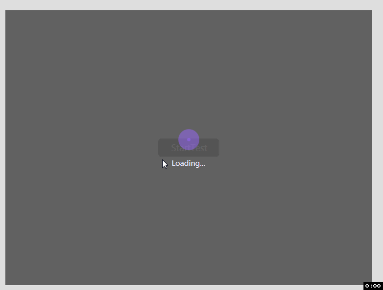
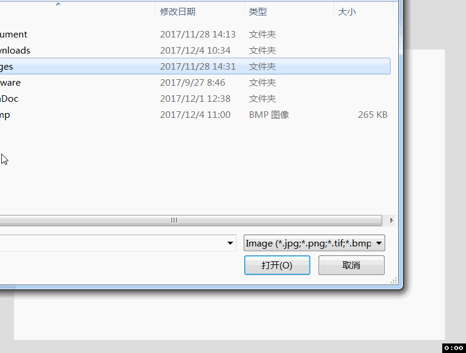
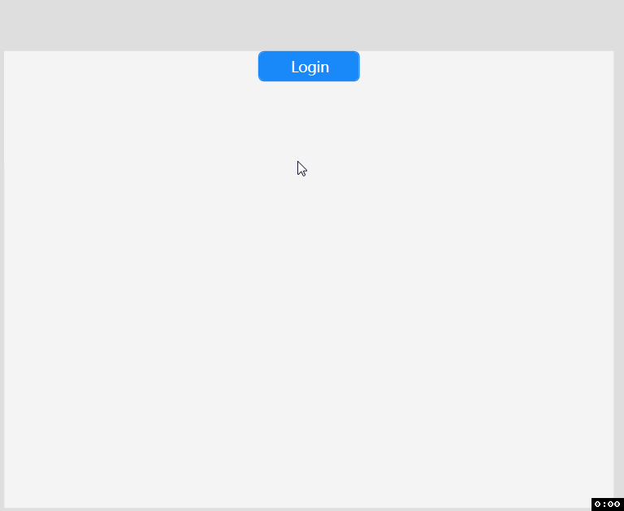
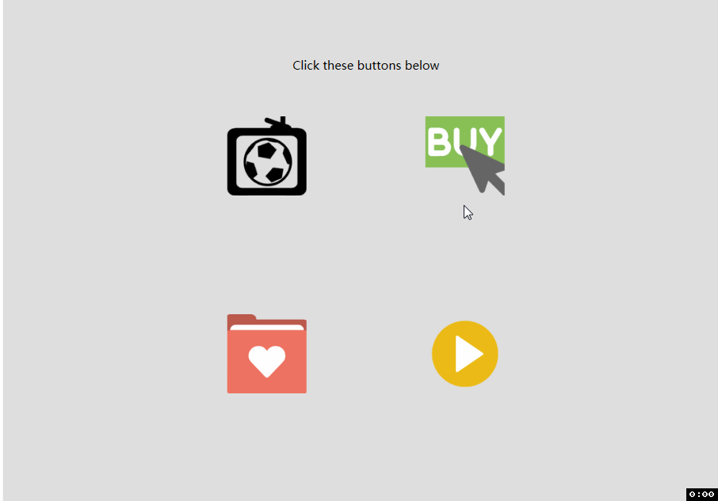
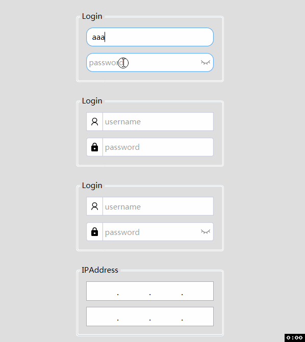
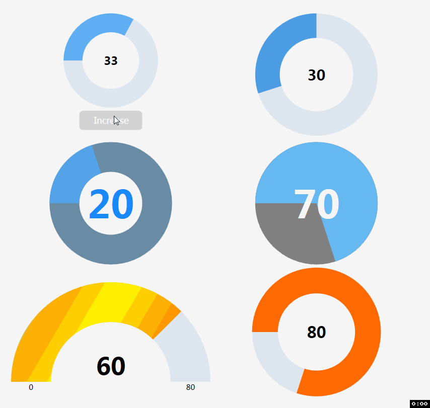
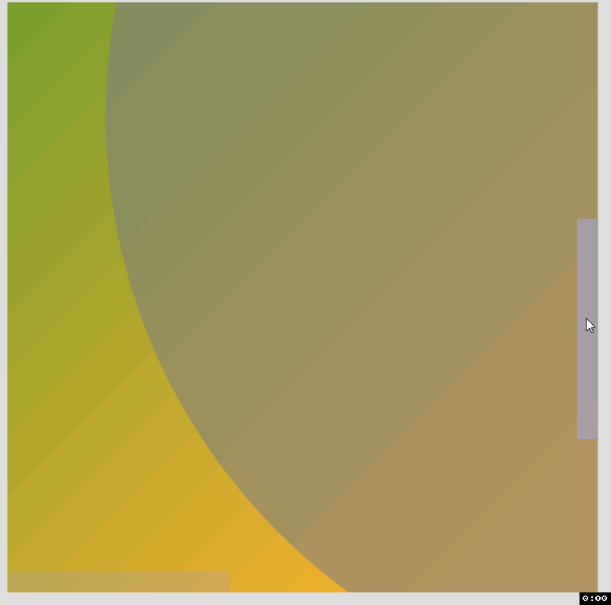

# WpfControlsDemo #

See also [CuteWpfControls](https://github.com/fengyhack/CuteWpfControls)

**How to build**

1.Open this project (in src folder) in Visual Studio 2015+

2.Restore the nuget package(s) in the package manager console
```
Install-Package CuteWpfControls
```

3.Build and Run

**What is in it**

1.BusyMask



2.TreeView


3.PhotoViewer: Panning & Zooming



4.LoginFlyout: Fly Animation



5.ImageButton



6.Timeline


7.Inputbox



8.SolidGauge



9.ScrollViewer

