# WpfControlsDemo #

See also [CuteWpfControls](https://github.com/fengyhack/CuteWpfControls)

**How to build**

1.Open this project (in src folder) in Visual Studio 2015+

2.Restore the nuget package(s) in the package manager console
```
Install-Package CuteWpfControls
```

3.Build and Run

**What is in it**

1. Loading

   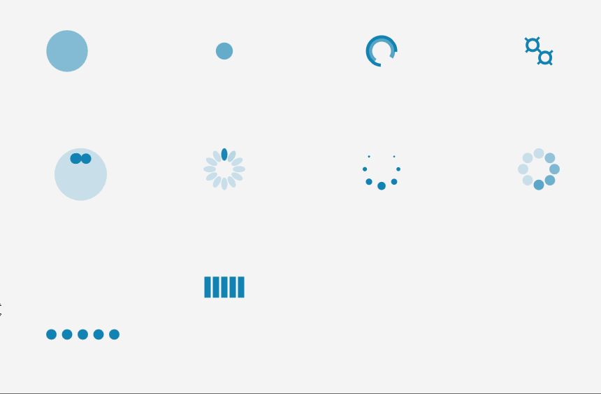

2. BusyMask

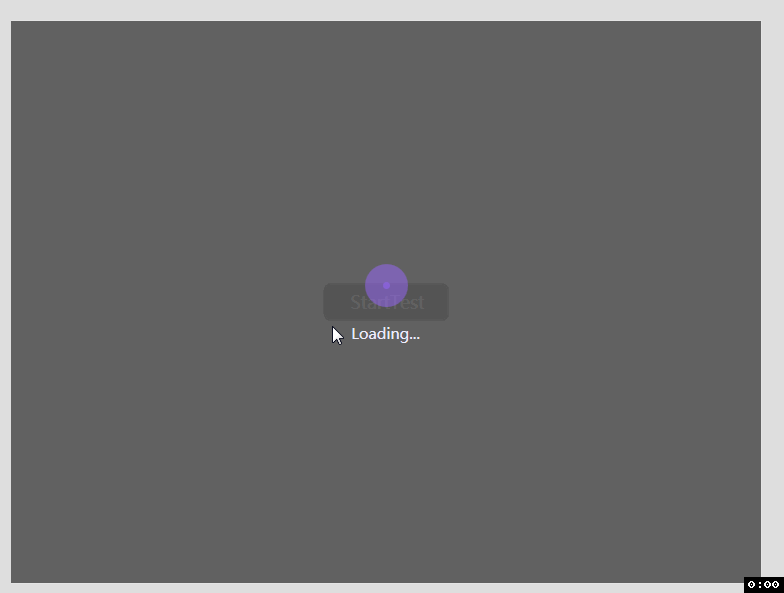

3. TreeView

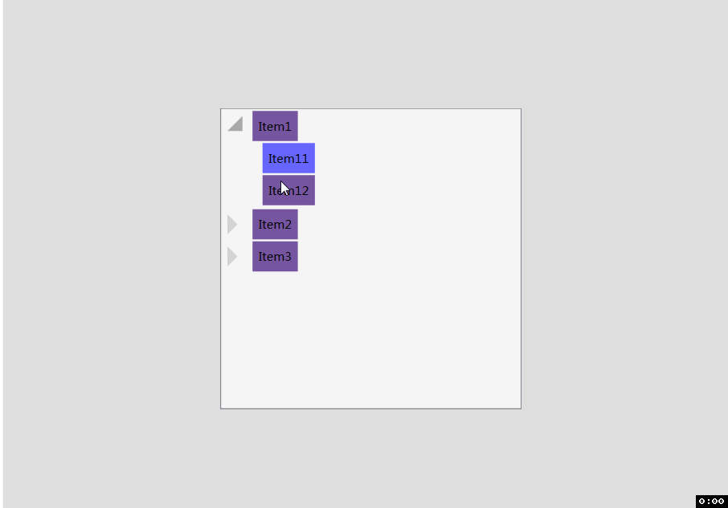

4. PhotoViewer: Panning & Zooming


5. LoginFlyout: Fly Animation

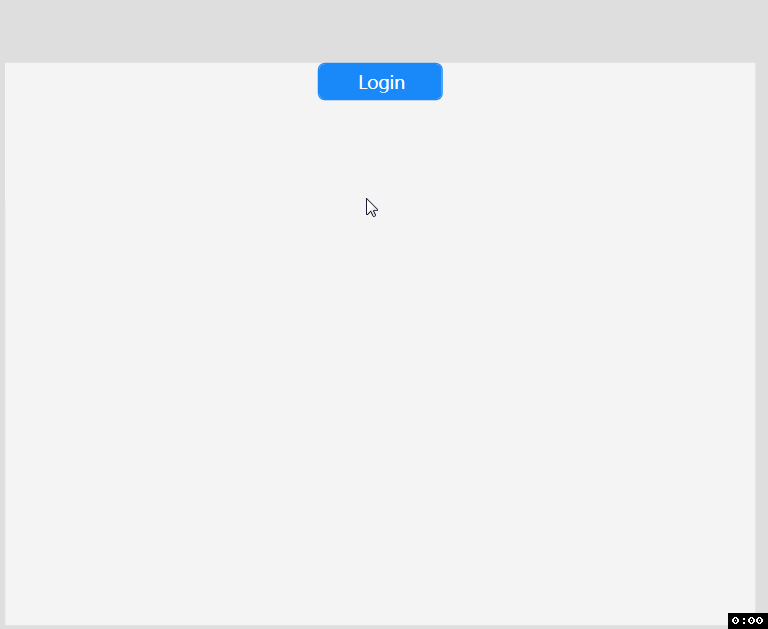

6. ImageButton

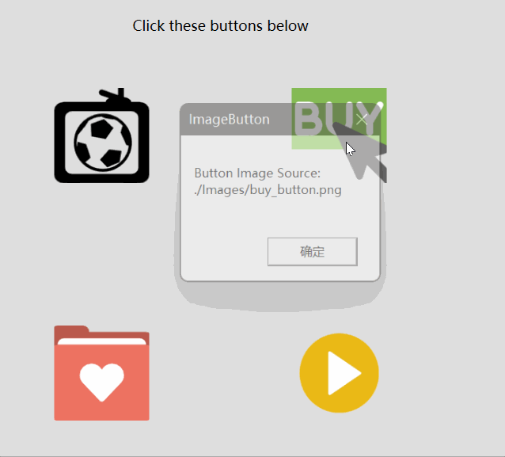

7. Timeline

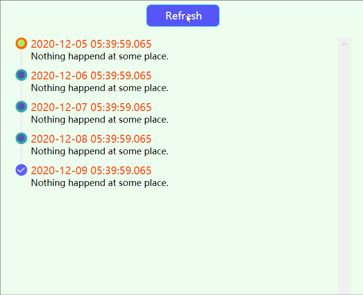

8. StepBar

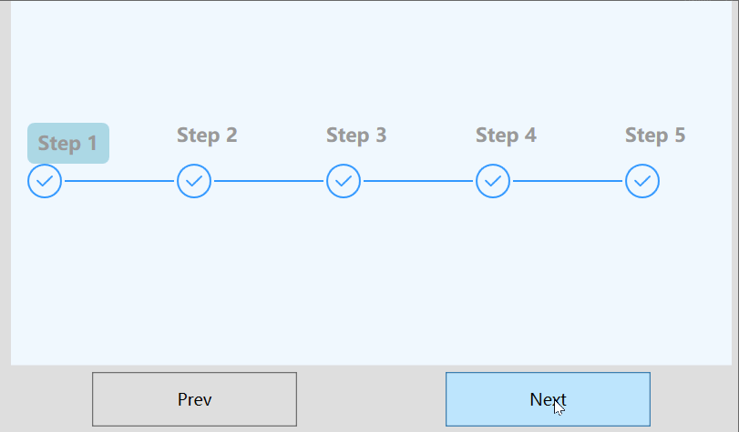

9. Inputbox

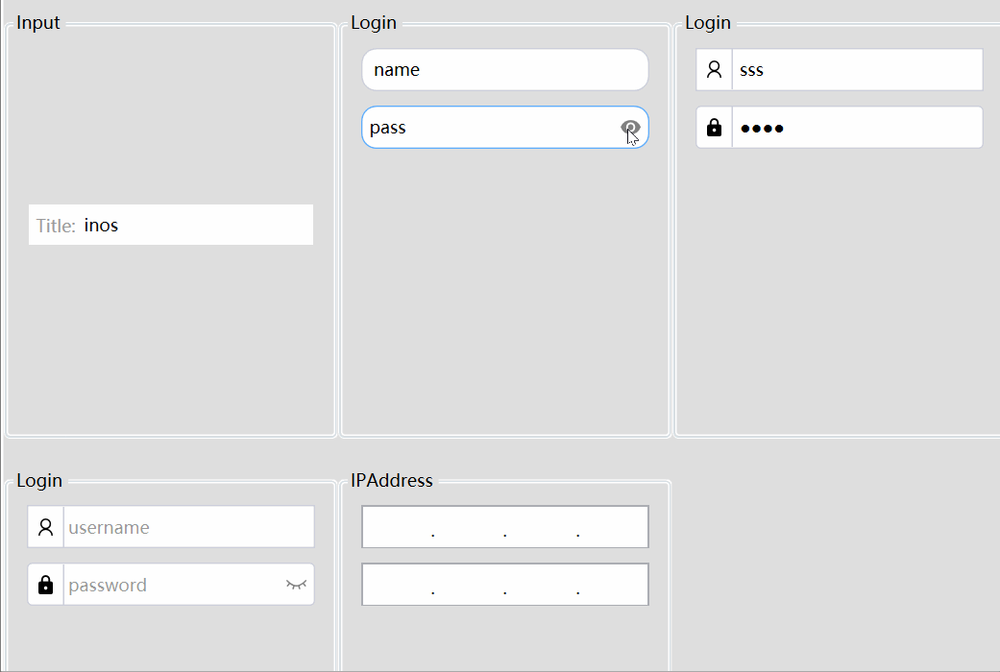

10. SolidGauge

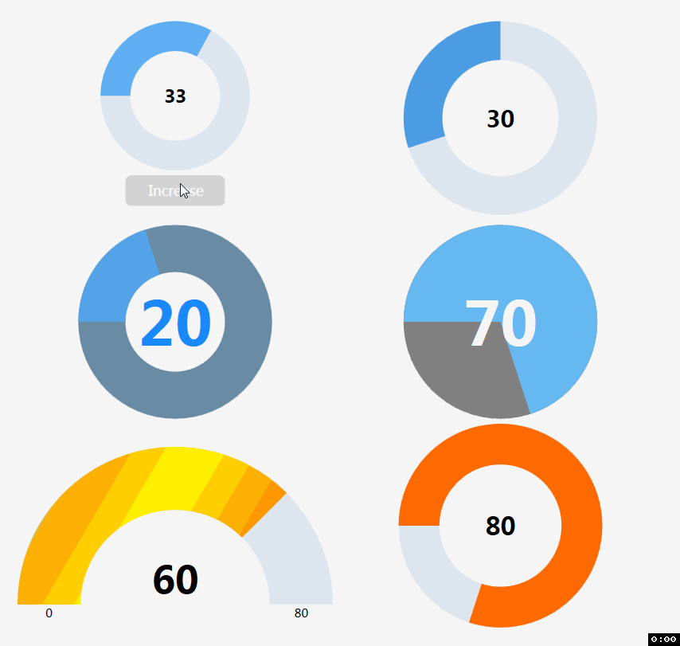

11. ScrollViewer

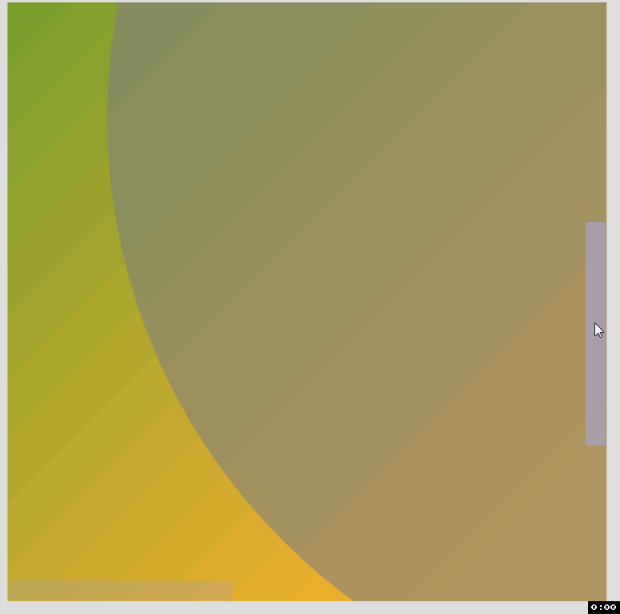2.

12. Badge

    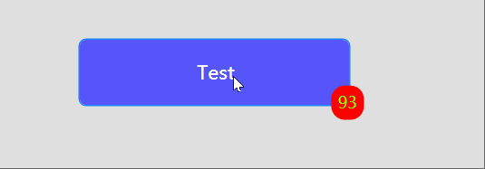

13. Toggle

    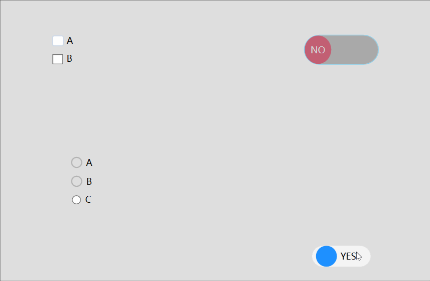

14. FlatSlider

    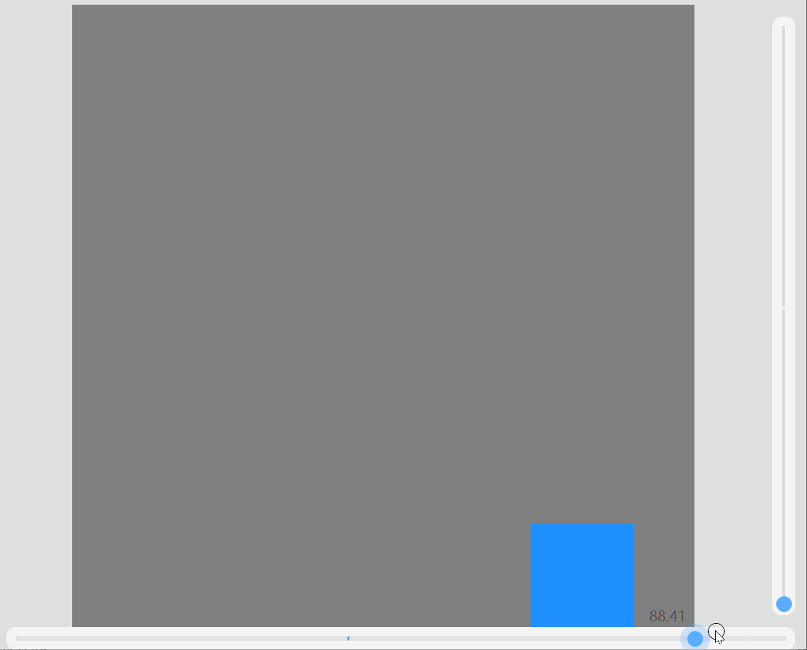


---

2021.10.21